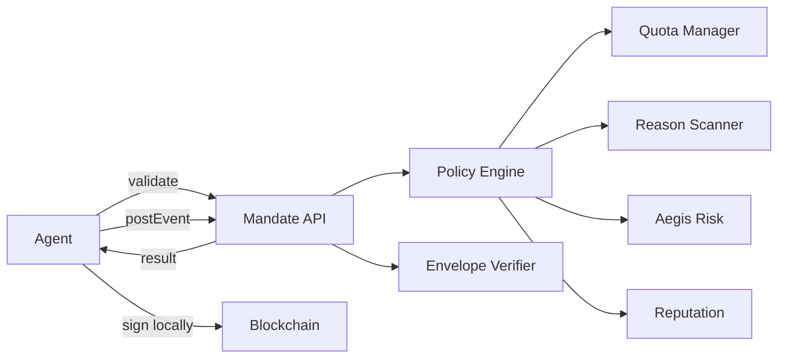

## What is Mandate's architecture?

Mandate is a policy enforcement layer between AI agents and blockchain networks. Every time an agent wants to send a transaction, it calls the Mandate API first. The API evaluates the request against the agent's configured policy and returns one of three outcomes: `allowed`, `blocked`, or `approval_required`. Private keys never leave the agent.

This architecture means Mandate controls what agents can do without ever holding the keys that let them do it. The agent signs and broadcasts locally. Mandate validates the intent, not the execution.

## How does the system flow work?

The core flow has three phases: validate, sign, confirm. The agent sends transaction details to the Mandate API. The policy engine runs 14 sequential checks. If all checks pass, the agent signs the transaction locally and broadcasts it to the blockchain. After broadcast, the agent reports the transaction hash back to Mandate for envelope verification.

The Mandate API never participates in signing. It receives the intent metadata (what the agent wants to do and why), evaluates it against policy, and returns a decision. The agent holds sole control over its private key throughout the entire flow.

## What backend services power Mandate?

Mandate's backend is a Laravel 12 (PHP 8.2) application running 10 core services. Each service handles one responsibility in the validation pipeline or post-broadcast verification flow.

| Service | Responsibility |
|---------|---------------|
| PolicyEngineService | 14 sequential validation checks against agent policy |
| QuotaManagerService | Daily and monthly spend tracking with atomic reservations |
| IntentStateMachineService | State transitions for intents, plus audit event logging |
| CircuitBreakerService | Emergency stop per agent, cached in memory and persisted to DB |
| CalldataDecoderService | ERC20 transfer, approve, and swap detection from raw calldata |
| PriceOracleService | Token amount to USD conversion for spend limit enforcement |
| EnvelopeVerifierService | On-chain transaction verification after broadcast |
| AegisService | Address risk screening against known exploit and scam signatures |
| ReputationService | EIP-8004 agent reputation scoring for on-chain identity |
| ReasonScannerService | Prompt injection detection with 18 regex patterns and optional LLM judge |

The PolicyEngineService orchestrates the others. It calls the CircuitBreakerService first, then checks policy rules in order, and delegates to the QuotaManagerService, AegisService, ReputationService, and ReasonScannerService at the appropriate points in the pipeline.

## How does authentication work?

Mandate uses three authentication layers depending on who is calling and why.

| Layer | Who | Mechanism | Example |
|-------|-----|-----------|---------|
| RuntimeKeyAuth | AI agents | Bearer token (`mndt_live_*` / `mndt_test_*`) | `Authorization: Bearer mndt_test_abc123` |
| Sanctum SPA | Dashboard users | GitHub OAuth + Laravel session | Browser cookie after login |
| No auth | Registration only | Public endpoint | `POST /api/agents/register` |

Runtime keys use a prefix convention: `mndt_live_` for mainnet (Ethereum, Base) and `mndt_test_` for testnet (Sepolia, Base Sepolia). The key identifies the agent and determines which policy applies. Dashboard users authenticate via GitHub OAuth and manage policies, approvals, and audit logs through the React frontend.

## What does the frontend look like?

The dashboard at `app.mandate.md` is built with React 19, Inertia.js, and Tailwind CSS 4. It provides 9 pages: Landing, Login, Dashboard, Agents, PolicyBuilder, Approvals, AuditLog, Claim, and Integrations.

Dashboard users configure policies, review pending approvals, inspect the audit trail, and manage agent registrations. The Claim page is where a human links an agent to their account after the agent registers via API. The PolicyBuilder page provides a visual editor for the 14-check validation pipeline.

## How do the SDK packages fit in?

The TypeScript monorepo in `packages/` provides SDK packages for 8 agent frameworks. The core package `@mandate/sdk` exports `MandateClient` (low-level API wrapper) and `MandateWallet` (high-level signing and broadcast flow with viem). Integration packages exist for ElizaOS, GOAT SDK, Coinbase AgentKit, Virtuals GAME, OpenClaw, ACP, and Claude Code.

All packages use bun workspaces and extend a shared `tsconfig.base.json` at the repo root. The SDK handles intent hash computation, error classification (5 error types), and approval polling automatically.

## Next Steps

<CardGroup cols={2}>
  <Card title="Policy Engine" icon="shield-check" href="/concepts/policy-engine">
    Deep dive into the 14 sequential validation checks.
  </Card>
  <Card title="Intent Lifecycle" icon="arrows-spin" href="/concepts/intent-lifecycle">
    Understand intent states from creation to on-chain confirmation.
  </Card>
  <Card title="Non-Custodial Model" icon="key" href="/concepts/non-custodial">
    Why Mandate never touches your private keys.
  </Card>
  <Card title="How It Works" icon="circle-play" href="/how-it-works">
    Step-by-step walkthrough of a validated transaction.
  </Card>
</CardGroup>
