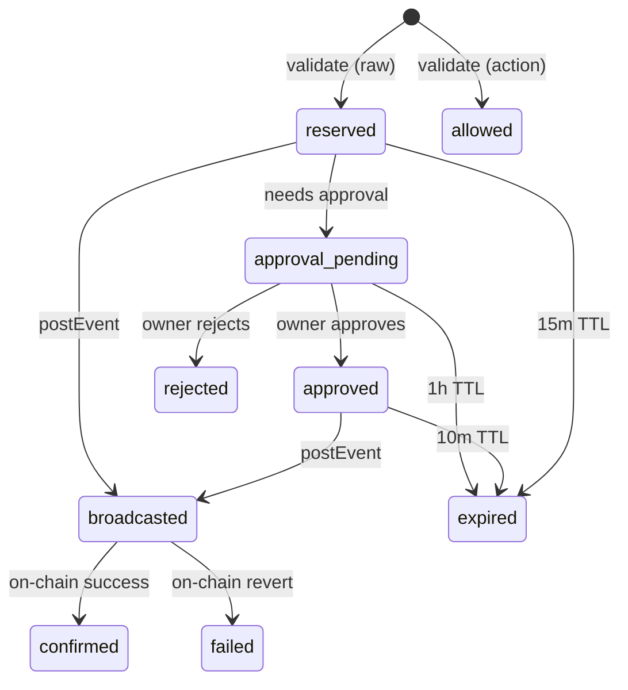

## What is an intent?

An intent represents a validated transaction request tracked through its full lifecycle. When an agent calls the Mandate API to validate a transaction, Mandate creates an intent record and tracks it from creation through signing, broadcast, and on-chain confirmation. Each intent has a unique ID, a state, and an expiration time.

Intents exist because blockchain transactions are not instant. Between validation and on-chain confirmation, the transaction passes through multiple stages. Mandate tracks each stage to enforce time limits, manage quota reservations, and build an audit trail.

## How does the state machine work?

Intents follow a strict state machine with 8 possible states. The entry point depends on which validation endpoint the agent uses: action-based validation creates an `allowed` intent, while raw validation creates a `reserved` intent. From there, the intent progresses through approval (if required), broadcast, and confirmation.

The state machine is implemented in `IntentStateMachineService`. Every transition writes an audit event to the `tx_events` table with the actor (agent, owner, or system), the new state, and metadata. Terminal states trigger quota release or confirmation depending on the outcome.

## What are the intent states?

| State | Description | TTL | Terminal |
|-------|-------------|-----|----------|
| `allowed` | Validated via action-based endpoint, ready to execute | 24 hours | Yes |
| `reserved` | Validated via raw endpoint, awaiting broadcast | 15 min | No |
| `approval_pending` | Waiting for human decision in the dashboard | 1 hour | No |
| `approved` | Human approved, broadcast window open | 10 min | No |
| `broadcasted` | Transaction hash posted, awaiting on-chain receipt | None | No |
| `confirmed` | On-chain confirmed, quota committed permanently | N/A | Yes |
| `failed` | On-chain reverted, cancelled, or envelope mismatch detected | N/A | Yes |
| `expired` | TTL exceeded without progression, quota released | N/A | Yes |
| `rejected` | Human rejected in the dashboard | N/A | Yes |

Terminal states (`confirmed`, `failed`, `expired`, `rejected`, `allowed`) end the intent lifecycle. Non-terminal states have TTLs enforced by a scheduled expiration job. When a non-terminal intent expires, Mandate releases any reserved quota back to the agent's budget.

## Who triggers each transition?

Five actors drive intent transitions. The agent initiates validation and reports broadcast. The owner approves or rejects. The system handles TTL expiration and envelope verification.

| Transition | Trigger | Actor |
|------------|---------|-------|
| `[new]` to `reserved` or `allowed` | Agent calls validate endpoint | Agent |
| `reserved` to `approval_pending` | Policy engine detects approval trigger | System |
| `approval_pending` to `approved` | Owner clicks approve in dashboard or Slack/Telegram | Owner |
| `approval_pending` to `rejected` | Owner clicks reject | Owner |
| `reserved` or `approved` to `broadcasted` | Agent posts transaction hash via `POST /intents/{id}/events` | Agent |
| `broadcasted` to `confirmed` | Envelope verifier confirms on-chain match | System |
| `broadcasted` to `failed` | On-chain revert or envelope mismatch detected | System |
| Any non-terminal to `expired` | Scheduled TTL check finds past-due intent | System |

When an envelope mismatch occurs (the on-chain transaction does not match the validated parameters), the system transitions the intent to `failed` and trips the agent's circuit breaker. This prevents further transactions until the owner investigates.

## How does quota management interact with intents?

Mandate reserves quota when an intent is created and manages it based on the terminal state. This prevents agents from circumventing spend limits by creating many intents simultaneously.

When the policy engine validates a transaction with a USD amount, the `QuotaManagerService` reserves that amount against the agent's daily and monthly budgets. The reservation holds until the intent reaches a terminal state. Confirmed intents convert the reservation to a permanent spend record. Failed, expired, or rejected intents release the reservation, restoring the budget.

An agent with a $1,000 daily limit that validates a $500 transaction has only $500 remaining for new validations, even before the first transaction confirms on-chain.

## Next Steps

<CardGroup cols={2}>
  <Card title="Intent States Reference" icon="list-check" href="/reference/intent-states">
    Complete reference for all intent states and their HTTP representations.
  </Card>
  <Card title="Validate Transactions" icon="shield-check" href="/guides/validate-transactions">
    Step-by-step guide to validating and tracking transactions.
  </Card>
  <Card title="Handle Approvals" icon="user-check" href="/guides/handle-approvals">
    Implement approval workflows with polling and callbacks.
  </Card>
  <Card title="Intent Hash" icon="fingerprint" href="/concepts/intent-hash">
    How the intent hash binds validation to execution.
  </Card>
</CardGroup>
