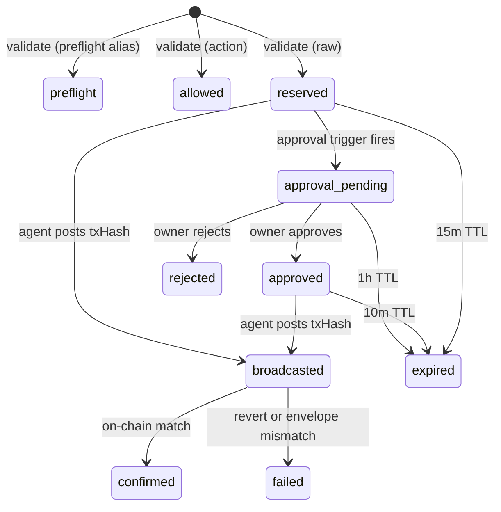

## What is the intent state machine?

Every validated transaction in Mandate is tracked as an intent. The intent moves through a strict state machine from validation to on-chain confirmation (or failure). The entry state depends on which endpoint the agent uses: action-based validation creates an `allowed` intent, raw validation creates a `reserved` intent.

## State diagram



## State reference

| State | Description | TTL | Terminal | Entry Point |
|-------|-------------|-----|----------|-------------|
| `preflight` | Validated via the `/validate/preflight` alias. Lightweight validation without quota reservation. | 30 min | No | Agent calls `POST /validate/preflight` |
| `allowed` | Validated via action-based endpoint (`POST /validate`). The transaction is approved by policy and ready to execute through the agent's wallet. | 24 hours | Yes | Agent calls validate |
| `reserved` | Validated via raw endpoint (`POST /validate/raw`). Quota is reserved. Awaiting broadcast. | 15 min | No | Agent calls raw validate |
| `approval_pending` | One or more approval triggers fired. Waiting for the owner to approve or reject in the dashboard, Slack, or Telegram. | 1 hour | No | System detects approval trigger |
| `approved` | Owner approved the transaction. The agent has a 10-minute window to broadcast. | 10 min | No | Owner clicks approve |
| `rejected` | Owner rejected the transaction. Quota is released. | N/A | Yes | Owner clicks reject |
| `broadcasted` | Agent posted a transaction hash via `POST /intents/{id}/events`. Waiting for the envelope verifier to confirm on-chain. | None | No | Agent posts txHash |
| `confirmed` | On-chain transaction matches the validated parameters. Quota reservation converts to a permanent spend record. | N/A | Yes | Envelope verifier confirms |
| `failed` | Transaction reverted on-chain, was dropped, or the envelope verifier detected a parameter mismatch. An envelope mismatch also trips the circuit breaker. | N/A | Yes | On-chain failure or mismatch |
| `expired` | TTL exceeded without the intent progressing to the next state. Quota reservation is released. | N/A | Yes | Scheduled expiration job |

## Transitions

| From | To | Trigger | Actor |
|------|----|---------|-------|
| _(new)_ | `preflight` | Agent calls `POST /validate/preflight` | Agent |
| _(new)_ | `allowed` | Agent calls `POST /validate` | Agent |
| _(new)_ | `reserved` | Agent calls `POST /validate/raw` | Agent |
| `reserved` | `approval_pending` | Policy engine detects an approval trigger | System |
| `reserved` | `broadcasted` | Agent calls `POST /intents/{id}/events` with `txHash` | Agent |
| `reserved` | `expired` | 15 minutes pass without broadcast | System |
| `approval_pending` | `approved` | Owner approves via dashboard, Slack, or Telegram | Owner |
| `approval_pending` | `rejected` | Owner rejects | Owner |
| `approval_pending` | `expired` | 1 hour passes without a decision | System |
| `approved` | `broadcasted` | Agent calls `POST /intents/{id}/events` with `txHash` | Agent |
| `approved` | `expired` | 10 minutes pass without broadcast | System |
| `broadcasted` | `confirmed` | Envelope verifier confirms on-chain match | System |
| `broadcasted` | `failed` | On-chain revert or envelope mismatch | System |

## Terminal vs non-terminal states

Terminal states end the intent lifecycle. No further transitions are possible.

**Terminal states:** `allowed`, `confirmed`, `failed`, `expired`, `rejected`

<Note>
`allowed` is not listed in the `TERMINAL_STATUSES` constant in source (`TxIntent.php`), but it does not transition further. The agent uses the validation result to proceed with their own wallet signing.
</Note>

**Non-terminal states:** `reserved`, `approval_pending`, `approved`, `broadcasted`

Non-terminal states have TTLs enforced by a scheduled expiration job. When the TTL expires, the intent moves to `expired` and any reserved quota is released back to the agent's budget.

## Quota behavior by terminal state

| Terminal State | Quota Action |
|----------------|--------------|
| `confirmed` | Reservation converts to permanent spend record |
| `failed` | Reservation released, budget restored |
| `expired` | Reservation released, budget restored |
| `rejected` | Reservation released, budget restored |
| `allowed` | No reservation (action-based validation does not reserve quota) |

## Polling for status

Use `GET /api/intents/{id}/status` to check the current state. The SDK provides convenience methods:

```typescript
// Poll for approval decision (5s interval, 1h timeout)
const status = await client.waitForApproval(intentId);

// Poll for on-chain confirmation (3s interval, 5min timeout)
const status = await client.waitForConfirmation(intentId);
```

Both methods throw `MandateError` if the intent reaches a terminal failure state.

## Next Steps

<CardGroup cols={3}>
  <Card title="Intent Lifecycle Concepts" icon="diagram-project" href="/concepts/intent-lifecycle">
    Conceptual explanation of how intents move through the system.
  </Card>
  <Card title="MandateClient" icon="code" href="/sdk/mandate-client">
    SDK methods for validation, event posting, and status polling.
  </Card>
  <Card title="Check Status (CLI)" icon="terminal" href="/cli/status">
    Poll intent status from the command line.
  </Card>
</CardGroup>
